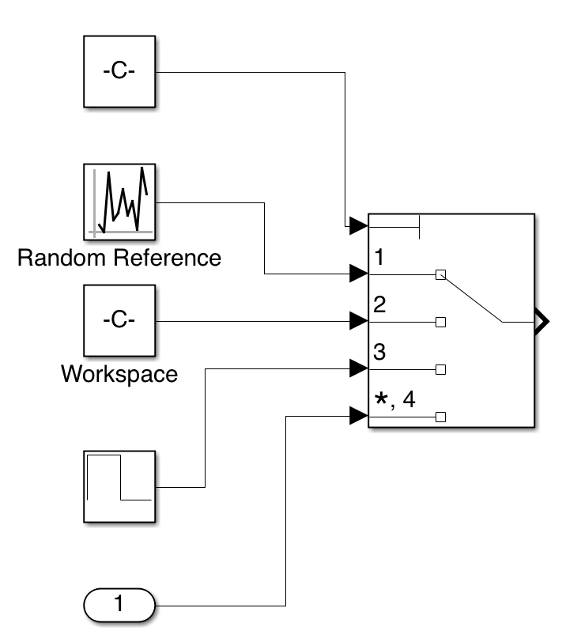
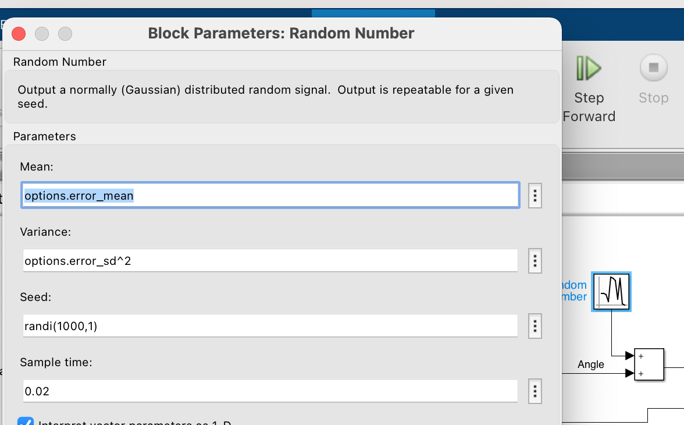

Approximating nominal feedback controllers by neural networks
===
In this work, we intend to mimic the behavior of a nominal controller by a feedforward Neural Network. The nominal controller might be an individual controller or a set of multiple controllers.

Download
----

The files can be downloaded via *ssh/https* or as a *zip* file. 

To clone the repository, (i) open your terminal, (ii) navigate to your desired directory, and (iii) write:
``git clone git@github.com:nikos-kekatos/NNCS_matlab.git``.

To test the latest updates, you can only download the ``nikos_comb`` branch.
``git clone -b nikos_comb --single-branch git@github.com:nikos-kekatos/NNCS_matlab.git``

If you have a problem with `ssh`, try
``git clone https://github.com/nikos-kekatos/NNCS_matlab.git`` or
``git clone -b nikos_comb --single-branch https://github.com/nikos-kekatos/NNCS_matlab.git``.

Requirements 
----
 
>**Necessary**

- MATLAB
- Simulink (all models are designed in Simulink)
- [Deep Learning toolbox](https://www.mathworks.com/products/deep-learning.html) (for constructing and storing the neural networks).

>**Falsification/Breach**

- Symbolic Matlab Toolbox
- Global Optimization Toolbox
- Optimization Toolbox
- Parallel Computing Toolbox (optional)

>**Models**

- Control System Toolbox (models with PID control)
- Simulink Control Design Toolbox (mode with gain-scheduling)
- Image processing Toolbox (optional, previous dependency was avoided)
- Model Predictive Control toolbox (models with MPC control) 
- Fuzzy Logic Toolbox (model with fuzzy inference rules & look-up table)
- Symbolic Matlab Toolbox (QuadMPC)

Dependencies
----

Apart from the MATLAB toolboxes, we use the [Breach](https://github.com/decyphir/breach) toolbox. Breach is a Matlab tool for  simulation-based design of dynamical/CPS/Hybrid systems. According to the guidelines, 

- Download Breach files
- Setup a C/C++ compiler using mex -setup
- add path to Breach folder
- Run InstallBreach

Installation
----
No special installation is required. The user has to add `Breach` and this repo (default name: `NNCS_matlab`) to the path. This can be done by right-clicking on the root directory and selecting `Add to Path >> Select Folder and SubFolder`. For Breach, the use has to run in the command window of MATLAB`>> InitBreach`.

Branches
----

There are several branches but they are not all property maintained. 
The **`nikos_comb`** contains the latest version of the code and this is the branch that should be used.
The `master` contains the stable version of the code.
The `Akshay` branch was used to check the code in a Windows machine.
The `nikosk` branch initially contained the ode without Breach falsification but only with coverage. The `falsif_breach` contained the initial integration of Breach without the iterative process.
The `nikos_dev` contained the full procedure for a single nominal controllers.

Usage
----
Once the user has added the corresponding files to the MATLAB path and has initialized Breach, they are ready to run different models. For each model, there is a corresponding `main` file. 

> Well-functioning models

- The user can navigate to the `src` and run 
`main_nncs.m`. There we can choose between models 1, 2, 3 corresponding to instances of the watertank, robotarm, quadcopter (linear controls) models.
- The `main_nncs_combination.m` corresponds to the model where we combine two controllers based on robustness or a user-defined cost function. Choose `options.combination_matlab=2` to use robustness and `options.combination_matlab=1` for LQR-like costs.
- Navigate to `models/Stateflow_Switched` and run `main_switched.m`.
- Navigate to `models/tank_reactor` and run `main_tank_reactor.m`.
- Navigate to `models/LookupTable` and run `main_lookup_table.m`.
- Navigate to `models/Switching_tf_hespanha` and run `main_hespanha.m`.
- Navigate to `models/EngineSpeedControl` and run `main_engine.m`.
- Navigate to `models/MatlabQuadSimAP-master` and run `main_quad_ardu.m`.

> Model Inputs

- One Simulink model (.slx) which contains the closed loop system (containing the plant and the nominal controller)
- One configuration file (config_...) which contains the configurations, ranges, conditions, coverage metrics, Simulink options, etc.
- One main file (main...) which performs the entire process.
- At least one requirement file (specs_) which contains the STL formula illustrating the closed-loop system properties/objectives.

Note that each model might contain additional files or there might be small differences.

> Procedure

- Initialization
- Running/Loading the configurations.
- **Trace Generation** using coverage, simulations, or Breach falsification/simulation.
- Selection of Data, Neural Network structure and parametrization, Preprocessing, Trimming.
- **Neural Network Training**
- Open loop testing and Simulink block generation
- **Matching error test** against STL properties.
- Falsification/retraining Loop 
	- Falsification with quasi random samples-- **Generalization Test**
	- If no cex, falsification with optimization-based techniques.
	- If cex, 
		- **Clustering** to evaluate the significance of the generated CEX. 		
		- Choose retraining options, method, etc.
		- **Retrain** using old (from trace generation or previous loop iterations) and new (cex) data.
		- Check CEX elimination
		- Plotting, additional tests, etc.

		
		
> Creating new Case Study

There is a number of steps that should be followed once we want to create a new case study. We are hereby talking about *Simulink models*.

1. We obtain/construct the nominal closed loop; most of our experiments come from Mathwork examples/demos/case studies.
2. We need to be able to change/manipulate the inputs to the entire closed-loop system, e.g. references. As such, 
	- We need to delete whatever input block is provided by the designer.
	- Add our own input block subsystem. There are two cases:
		1. In case we choose to use Breach for data generation, we should simply add inports. For example, for a reference tracking problem with 3 references, we should add an inport block for each reference and name them as `In1`, `In2`, `In3`. Check the `models/MatlabQuadSim-master/Quadrotor_stable.slx`.
		2. If we want to use user-defined ways to perform data generation, we should replace each input blocks by the input template (multiport switch). It can be found at `templates/input_block_template`. See below.
3. Add `Save to Workspace` blocks	to specify the relevant signals/variables. The common notation used contains `ref` for references, `u` for control signals, and `y` for relevant plant outputs. It is important to specify the `sample time` block (typically defined as `options.dt`). 
4. (Optional) specify additive noise in one or multiple plant outputs. This is currently done via a `random number` block. 
	
	.... To_do how to add duplicates with NN.
	
More information regarding the code structure will be added. There are several options, features in the code which might be unclear in the beginning. 

