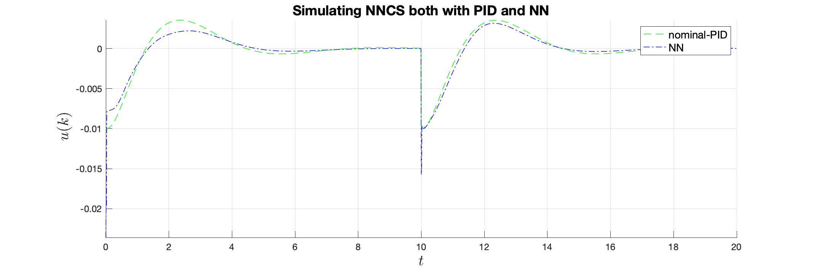
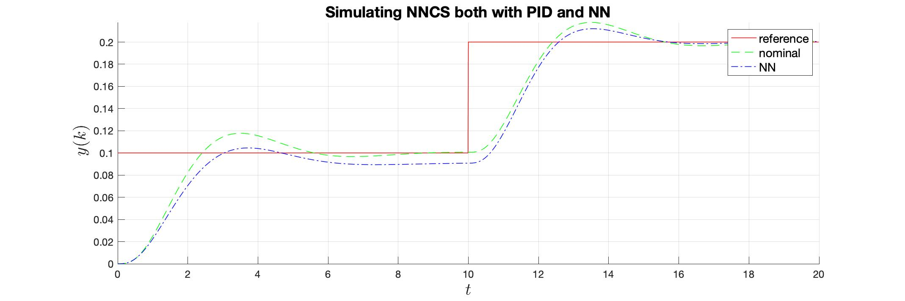

Quadrotor Model based on ArduPilot 
---

The MATLAB files were taken from Wilseby [GitHub repo](https://github.com/wilselby/MatlabQuadSimAP). It is used for simulating a 3DRobotics ArduPilot based quadrotor.

>There is another MATLAB [repo](https://github.com/yrlu/quadrotor) that I came across.

#### Files
---------

This folder contains several Simulink models. The [`utilities`](https://github.com/nikos-kekatos/NNCS_matlab/tree/nikos_comb/models/MatlabQuadSimAP-master/utilities) contains various function provided by the author; only the [`quad_variables.m`](https://github.com/nikos-kekatos/NNCS_matlab/blob/nikos_comb/models/MatlabQuadSimAP-master/utilities/quad_variables.m) script is needed for our experiments. It initializes the variables of the Simulink model via the `Quad` object.

>The original model is numerically unstable and it can be observed by changing the desired values for example `x_des=1`. 

Our first goal has been to find a range that the model can be simulated without errors. This is done via exhaustive testing. The code for identifying and testing these ranges is [`main_quad_range_checking.m`](https://github.com/nikos-kekatos/NNCS_matlab/blob/nikos_comb/models/MatlabQuadSimAP-master/main_quad_range_checking.m). This is a standalone file. It employs the [`Quadrotor_rangeChecking.slx`](https://github.com/nikos-kekatos/NNCS_matlab/blob/nikos_comb/models/MatlabQuadSimAP-master/Quadrotor_rangeChecking.slx) model.

#### Findings
---------
We use Breach for simulations and we have established a successful linking after fixing various matters. The latest analysis results indicate that the following ranges do not produce any error.

| Parameter | Values  |   
|:------------:|:-------:|
| Simulations   | 2000 |
|Reference X| |
| Original X| $$ \begin{equation}x_{des}=0.25\end{equation} $$|
|Reference Y| \\[ y_{des} \in [0,0.1] \\]|
| Original Y| \\[y_{des}=0 \\]|
|Reference Z| \\[z_{des} \in [0.2,0.4] \\]|
| Original X| \\[z_{des}=0.5\\]|

We start by replacing only the high level controller. Note that the $z_{des}$ does not appear in this controller, as such the reference should not be used for training.

The [`Quadrotor_stable`](https://github.com/nikos-kekatos/NNCS_matlab/blob/nikos_comb/models/MatlabQuadSimAP-master/Quadrotor_stable.slx) is to be used for trace generation.  The model [`QuadrotorSimulink_no_memory`](https://github.com/nikos-kekatos/NNCS_matlab/blob/nikos_comb/models/MatlabQuadSimAP-master/QuadrotorSimulink_no_memory.slx) contains the NN controller where the nominal controller has been replaced by an NN without any memory. The model [`QuadrotorSimulink_w_memory`](https://github.com/nikos-kekatos/NNCS_matlab/blob/nikos_comb/models/MatlabQuadSimAP-master/QuadrotorSimulink_w_memory.slx) contains the NN controller with 2 control input delays, 3 output delays, and 3 reference delays.To evaluate our falsification/training loop, the user should use the [`main_quad_ardu.m`](https://github.com/nikos-kekatos/NNCS_matlab/blob/nikos_comb/models/MatlabQuadSimAP-master/main_quad_ardu.m). 
The configuration parameters are defined in the [`config_quad_ardu.m`](https://github.com/nikos-kekatos/NNCS_matlab/blob/nikos_comb/models/MatlabQuadSimAP-master/config_quad_ardu.m). 

> Currently, the lack of memory seems detrimental to designing a sufficiently good NN controller.

After several experiments and configurations, we found out that for 20 random traces with reference and output delays, it was possible to design a NN controller which tracks the references. Note the lack of control input delays and the fact that the training/validation error $~10^{-8}$. Random simulation traces follow 

