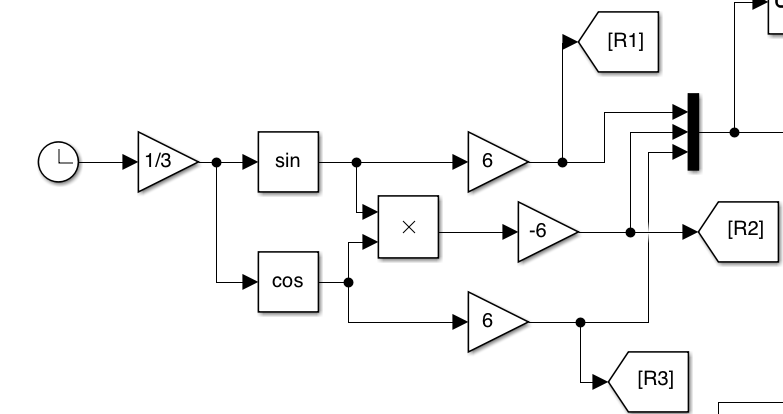

Quadorotor model with MPC Controller
---

This folder contains our efforts towards replacing an MPC controller by an NN. The original model is designed by [Mathworks](https://www.mathworks.com/help/mpc/ug/control-of-quadrotor-using-nonlinear-model-predictive-control.html).

## Model/Configuration

> Intro

This example shows how to design a nonlinear model predictive controller for trajectory tracking of a quadrotor. The plant is a standard 12-dimensional dynamical system and the controller is designed in MATLAB as a nonlinear MPC with a quadratic cost function. There are 12 states, 12 plant outputs, and 4 control ouputs.

In the nominal expriment, six states/plant outputs are being tracked. Three (*x**d**e**s*, *y**d**e**s*, *z**d**e**s*)follow sinusoidal references while the rest three (Euler angles) get desired values of zero.

> Objective

According to Mathworks, the "quadrotor tracks the reference trajectory closely." More specifically, this relates to 

- The states \[*x*, *y*, *z*\] matching the reference trajectory very closely within 7 seconds.

- The states \[*ϕ*, *θ*, *ψ*\] are driven to the neighborhood of zeros within 9 seconds.

>Code

The original code from Mathworks is added in the `original/` directory. It consists of Matlab scripts and functions.

The dynamics and Jacobians of the quadrotor are derived using `Symbolic Math Toolbox` software. Note that the `getQuadrotorDynamicsAndJacobian` script generates the following files:

1. `QuadrotorStateFcn.m` — State function

2. `QuadrotorStateJacobianFcn.m` — State Jacobian function

The references are given as a function of time in `QuadrotorReferenceTrajectory(t)`.

## Our Approach

We have to modify the model to match our framework for trace generation, coverage and falsification. Note that existing architecture assumes that the modeling is done in Simulink.

> Steps

1. Perform trace generation in Matlab
	- Create a function `QuadrotorReferenceTrajectory_param.m` that
        outputs parametric sinusoidal references for states
        \[*x*, *y*, *z*\]. Specifically, the references that we
        generated with a coverage approach in mind were of the form:
        *r**x* = *In*1 ⋅ sin (*t*/3),
        *r**y* = *In*2 ⋅ sin (*t*/3) ⋅ cos (*t*/3),
        *r**z* = *In*3 ⋅ sin (*t*/3), with
        5.5 ≤ *In*1 ≤ 6.5, − 6.6 ≤ *In*2 ≤ 5.6
        and 5.5 ≤ *In*3 ≤ 6.5.
	- choose grid resolution for *In*1,
        *In*2 and *In*3.
	- run the nominal controller for each combination of reference values.
	- store and concatenate all the generated traces in the structure `data` which can be accessed via `data.REF`, `data.Y` and `data.U`. 	
2. Data selection and Neural Network Training
	- Choose which are the inputs/outputs of the Neural Network.  *I**NN* = {*r*, *y*}, and
        *O**NN* = {*u*}.

		**Questions:** Do we need all 6 references (three are always zero)? Do we need all 12 plant outputs or only the ones that are tracked? Do we need memory, i.e. previous/delayed values? 
	
	- Choose network structure
	- Perform training and generate NN.
	- Save NN as a Simulink block via `gensim`.
3. Closed-loop analysis in Simulink
	-  The NN is saved in Simulink and the plant has to be modelled in Simulink as well via an `Interpreted MATLAB Function`. The reference signals have to be modelled as well, see Figure below for the default/nominal reference signals. 
	
	- After the interconnections are done, the closed-loop system is designed, see `quad_mpc_nn.slx`.
4. Continue with falsification (not implemented yet)

> Files

1. `main_quad_mpc.m`: the main file which performs all the computations and steps
2. `quad_mpc_nn.slx`: Simulink model that contains the closed-loop with a neural network controller.
3. `config_quad_mpc`: configuration file which sets the simulation options, e.g. trace duration, coverage settings (reference ranges, resolutions), sampling time, etc. 
4. `quad_mpc_init.m`: initializes the MPC, auto-generates some MATLAB files (needed by MPC toolbox) as well as specifies weights, prediction and control horizons. 
5. `QuadrotorReferenceTrajectory_param.m`: is a function that defines the parametric sinusoidal reference signals.
6. `QuadrotorFcn.m`: modified function to define the *plant* for Simulink
7. `plotQuadrotorTrajectory`: plotting of the nominal controller
8. `quad_mpc.slx` : attempt to build the nominal control in Simulink (not working)
9. The folder `original` contains the default/original model files from Mathworks. You can run the `ControlOfQuadrotorUsingNLMPCExample.mlx` file.
10. The folder `testing` contains several scripts/models. They can be ignored.

How to run?
---

>**Necessary** Requirements/Dependencies

- MATLAB
- Simulink (all models are designed in Simulink)
- [Deep Learning toolbox](https://www.mathworks.com/products/deep-learning.html) (for constructing and storing the neural networks).
- MPC toolbox
- Currently, we have not integrated falsification in our experiments. So, `Breach` is not needed yet.
 
>Installation & Usage

1. Download the repository (entire or specific `nikos_comb` branch). For example, ``git clone https://github.com/nikos-kekatos/NNCS_matlab.git`` or for the branch
``git clone -b nikos_comb --single-branch https://github.com/nikos-kekatos/NNCS_matlab.git``.
2. Navigate to the right directory `models/QuadMPC/`
3. run `main_quad_mpc.m`
4. You can use pre-generated traces (default option) to speed up the process and directly check different NN configurations. You can run the trace generation yourself by changing the command `options.pretrained=1` to `options.pretrained=0`. For evaluation, the simulation section will likely return an error (variables going to infinity). Instead, you could open the Simulink model and inspect the scopes.

>Update repository

If you have already cloned the repo, you could try

1. git checkout nikos_comb
2. git pull
 
Experiments
--

For the following experiments, we have assumed that (i) initial
conditions *x*0 = \[7;  − 10; 0; 0; 0; 0; 0; 0; 0; 0; 0; 0\];, and (ii)
there is a nominal control that keeps the quadrotor floating
*nloptions*.*MVTarget* = \[4.9; 4.9; 4.9; 4.9\];

[//]: #(https://pandoc.org/try/?text=&from=markdown&to=gfm&standalone=0)
<table style="width:100%;">
<colgroup>
<col style="width: 8%" />
<col style="width: 15%" />
<col style="width: 15%" />
<col style="width: 11%" />
<col style="width: 18%" />
<col style="width: 8%" />
<col style="width: 22%" />
</colgroup>
<thead>
<tr class="header">
<th style="text-align: center;">No</th>
<th style="text-align: center;">#Ref</th>
<th style="text-align: center;">#Y</th>
<th style="text-align: center;">Memory</th>
<th style="text-align: center;">Coverage</th>
<th style="text-align: center;">Traces</th>
<th style="text-align: center;">Status</th>
</tr>
</thead>
<tbody>
<tr class="odd">
<td style="text-align: center;">1</td>
<td style="text-align: center;">3/6</td>
<td style="text-align: center;">12/12</td>
<td style="text-align: center;">no</td>
<td style="text-align: center;">\(5.5\leq In_1\leq6.5\), \(-6.6\leq In_2\leq5.6\),  \(5.5\leq In_3\leq6.5\).</td>
<td style="text-align: center;">4</td>
<td style="text-align: center;">NNCS exploded</td>
</tr>
<tr class="even">
<td style="text-align: center;">2</td>
<td style="text-align: center;">3/6</td>
<td style="text-align: center;">12/12</td>
<td style="text-align: center;">no</td>
<td style="text-align: center;">\(5.5\leq In_1\leq6.5\), \(-6.6\leq In_2\leq5.6\),  \(5.5\leq In_3\leq6.5\).</td>
<td style="text-align: center;">8</td>
<td style="text-align: center;">NNCS exploded</td>
</tr>
<tr class="odd">
<td style="text-align: center;">3</td>
<td style="text-align: center;">3/6</td>
<td style="text-align: center;">6/12</td>
<td style="text-align: center;">no</td>
<td style="text-align: center;">\(5.5\leq In_1\leq6.5\), \(-6.6\leq In_2\leq5.6\),  \(5.5\leq In_3\leq6.5\).</td>
<td style="text-align: center;">8</td>
<td style="text-align: center;">NNCS exploded</td>
</tr>
<tr class="even">
<td style="text-align: center;">4</td>
<td style="text-align: center;">3/6</td>
<td style="text-align: center;">6/12</td>
<td style="text-align: center;">yes</td>
<td style="text-align: center;">\(5.5\leq In_1\leq6.5\), \(-6.6\leq In_2\leq5.6\),  \(5.5\leq In_3\leq6.5\).</td>
<td style="text-align: center;">27</td>
<td style="text-align: center;">NNCS exploded</td>
</tr>
<tr class="odd">
<td style="text-align: center;">5</td>
<td style="text-align: center;">3/6</td>
<td style="text-align: center;">12/12</td>
<td style="text-align: center;">no</td>
<td style="text-align: center;">\(5.5\leq In_1\leq6.5\), \(-6.6\leq In_2\leq5.6\),  \(5.5\leq In_3\leq6.5\).</td>
<td style="text-align: center;">27</td>
<td style="text-align: center;">NNCS exploded</td>
</tr>
</tr>
<tr class="even">
<td style="text-align: center;">5</td>
<td style="text-align: center;">6/6</td>
<td style="text-align: center;">12/12</td>
<td style="text-align: center;">yes(k-1)</td>
<td style="text-align: center;">\(5.5\leq In_1\leq6.5\), \(-6.6\leq In_2\leq5.6\),  \(5.5\leq In_3\leq6.5\).</td>
<td style="text-align: center;">27</td>
<td style="text-align: center;">NNCS exploded</td>
</tr>
</tbody>
</table>

^^NNCS explosion means that the closed loop system was not able to track the references and some plant outputs were going to infinity.

The NN training in open-loop seems okay however in closed-loop is not good enough yet. 

**Remark: Each trace contains 200 points with $T=20$ and $dt=0.1$. This is coming from the MPC. We probably have to change it.**
## Earlier Attempts (ignore)

>Goal: Convert this model into an equivalent Simulink model

That means that the plant, controller and reference previewing have to be replaced by equivalent Simulink blocks. The *plant* is defined as an ODE function. In order to use the existing function inside Simulink, we used the Interpreted Matlab function following this [link](https://www.youtube.com/watch?v=QKhy1JsdiUo). The MPC was replaced by the NMPC block and the references by simple input "source signals". The interconnections were added accordingly.

Remark: the Simulink and the Matlab control systems are not matching each other.

> Testing

Run the `quad_mpc.slx` model in Simulink and inspect the scopes. The reference (x, y,z) and the actual values of x, y, z states are not matching. Especially, for sinusoidal-like references the mismatch is large.

