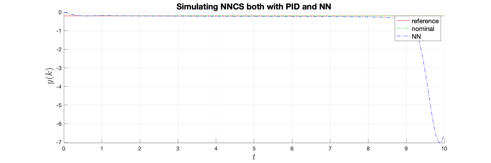

# Problematic Neural Network

###### This is an instance of a poorly designed Neural Network. The network fails to generalize and after changing the input signal (reference) the closed-loop system becomes unstable. This unexpected behavior only happens for specific inputs and was found through testing. This example can serve as a justification of the necessity of rigorous/exhaustive testing. 

#### Requirements 
------

Running the accompanied model requires the installation of Matlab/Simulink in your machine. The [Deep Learning toolbox](https://www.mathworks.com/products/deep-learning.html) should also be installed. No other toolboxes or add-ons are required.

#### Installation
---------
No special installation is needed. The files should be downloaded from the [Github repository](https://github.com/nikos-kekatos/NNCS_matlab) via ssh or https. You can simply download the zip files. 

Clone the repository via git as follows:

```
git clone https://github.com/nikos-kekatos/NNCS_matlab.git
cd NNCS_matlab/outputs/robotarm/bad-design
```

#### Files
---------
This folder contains: 

	1) a Simulink model
	2) an .m file to run, simulate and visualize the traces
	3) an .m file to get the weights and the biases of the Simulink block and save them as a network object.
	

The **Simulink** model provides an implementation of the single-link robot arm from the [Mathworks repository](https://www.mathworks.com/help/deeplearning/ug/design-model-reference-neural-controller-in-simulink.html). The control objective is to track a reference signal. Inside the Simulink file, there are two closed-loop systems: (i) anominal controller (discrete-time PID) and (ii) a Neural Network controller.

For the Neural Network Control System (NNCS), we provide a variety of different neural networks. The neural networks have been trained under the same conditions with the main exception being the different preprocessing resolution. This resolution was computed via the Matlab command `uniquetol`. More details can be found [here](https://www.mathworks.com/help/deeplearning/ug/design-model-reference-neural-controller-in-simulink.html). The tolerance used for each neural network is shown in the name of the generated Simulink block, e.g. `pre_0.01`.

#### Usage
-----
To run the files, you simply need to navigate to the `./bad_design` directory. Then, you can directly run the files. There are two options:

> Running the SLX file

The bad design corresponds to the neural network described by the block `pre_0.00003`. To run the Simulink as a standalone, we have added a pre-load function as a model callback. This is done via the Model Explorer. The commands added are as follows.

```
const_ref=-0.1
options.dt=0.02
```
Note that these variables will be loaded and stored in the workspace as soon as you open the Simulink file.

> Running the Matlab file

Simply running the function `call_run_and_plot`, simulates the Simulink model and plots the results for `const_ref=-0.1` and `const_ref=-0.2`.

#### Results
-------

> Erroneous behavior

Changing the constant reference to `const_ref=-0.2` yields the unstable behavior displayed below.



> Obtaining the weights and biases from the Simulink block.

Calling the function `finding_weights` with or without inputs will return all the relevant information for the Neural Network, focusing on its architecture, weights, biases, and normalization factors. In addition, it will recreate the network object in Matlab. The entire process is automated and the goal is to create a function that is doing the opposite task of `gensim`.